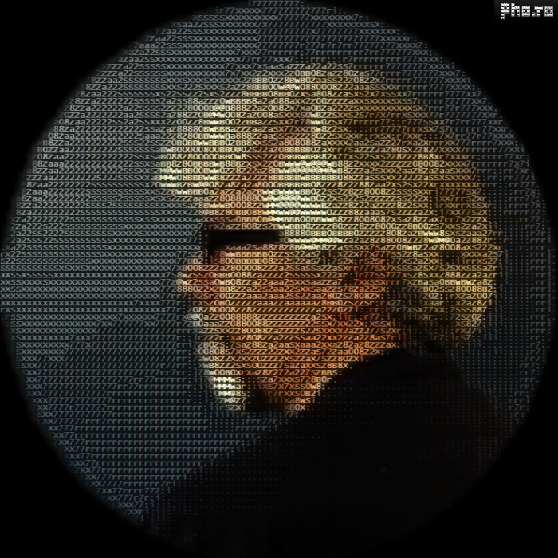

## Seja bem vinda(o)! 👋

- 🔭 Trabalho atualmente no DNOCS (Departamento Nacional de Obras Contra as Secas)
- 🌱 Atualmente elaborando um livro sobre o Laravel 9
- 🤔 Estou colaborando e aprendendo em alguns grupos do Facebook
- Meu foco é no Back-end com PHP
- Aprendendo front-end com a intenção de chegar a full-stack
- Começando a compartilhando reflexões/informações no blog: https://ribamar.net.br/portal/blog (está no início)
- Apaixonado por programação e servidores
- Atualmente compartilho praticamente tudo que aprendo e descubro por aqui. Veja que existe uma boa quantidade de repositórios. :)

 
Art ASCII criada aqui https://funny.pho.to/pt/image-to-text-effect/
